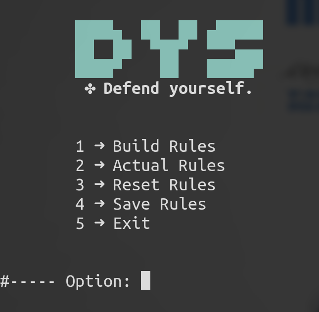

### ./vista.sh
> A web recon framework using Shell Script with some tools.

### ./dys.sh
> A firewall manager using iptables.

---

**Some projects for my personal experience. I'm working on it, they're not ready!**
